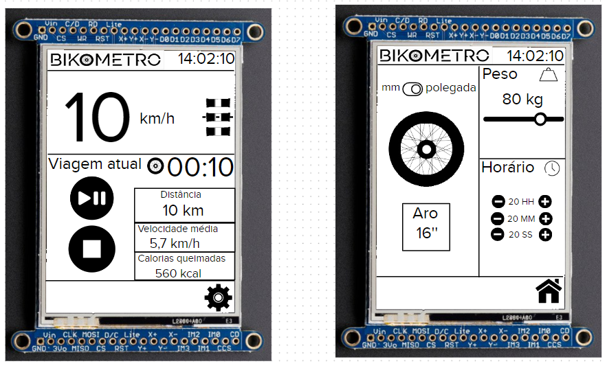
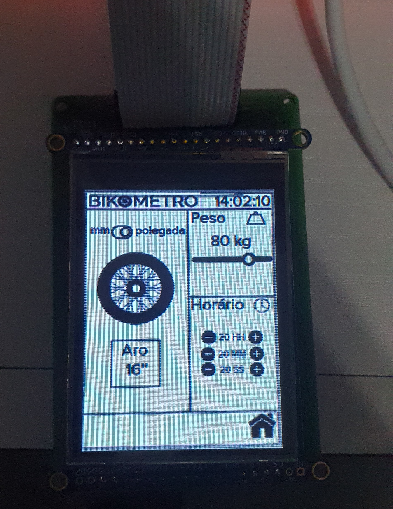

# 21b - APS2 - Embarcados

O marketing de uma empresa de equipamentos esportivos quer criar um novo ciclocomputador e você foi escolhido como desenvolvedor autônomo, dado seu background técnico e de UX, para criar um protótipo e validar a ideia.

Mais detalhes no site da disciplina:

- https://insper.github.io/ComputacaoEmbarcada/navigation/APS/APS-2-Bike/Descricao/

## Detalhes

Integrantes:

- Ricardo Ribeiro Rodrigues
- Guilherme Fontana Louro

Nome da marca:

- Bikometro

## Interface

### Proposta UX 1 - C

#### **Primeira proposta de interface**

#### **Widgets a serem utilizados**

- Para botões, iremos utilizar **Image button (lv_imgbtn)** para utilizar icones como botões.
- Para a unidade escolhida na segunda tela, será utilizado **Switch (lv_switch)**.
- Será utilizado **Image (lv_img)** para o logo.
- Para texto, será utilizado **Label (lv_label)**.
- Para a escolha do aro, será utilizado o **Roller (lv_roller)**.
- Para o input do peso, será utilizado o **Slider (lv_slider)**.

#### **Interface executada no LCD**

 

 

#### **Video explicando a interface**

### Proposta UX 2 - B

Detalhes da segunda interação da proposta de interface:

#### **Video da entrevista com o Luiz**

A partir do feedback do Luiz, foi feito algumas alterações na interface, como:
- Maior aproveitamento do espaço da tela, deixando velocidade e botões com mais espaço.
- Adiciona a possivibilidade de alternar entre as unidades de medida (cm/polegadas).
- Os botões de alterar o aro da bicicleta alternam entre valores predefinidos.
- O valor atual do aro da bicicleta é mostrado na tela.
- Adicionado botão para voltar para tela inicial na segunda tela.

#### **Imagem da proposta 2**

#### **Interface da proposta 2 executada no LCD**

 

 

Nesta iteração, foi decidido também as **fontes e tamanhos** utilizados na interface:
- Para o logo, foi utilizado a [**fonte Raleway Medium Alt1**](https://fonts.google.com/specimen/Raleway)
- Para o resto da interface foi utilizado a fonte [**Montserrat Alternates Extralight 200**](https://fonts.google.com/specimen/Montserrat+Alternates?category=Sans+Serif&preview.text=Viagem%20atual&preview.text_type=custom). 

Tais fontes são futuristas que remetem à tecnologia e são unidas com a simplicidade e design limpo e leve do preto no branco. Dessa forma, é mantido um padrão de duas fontes sans-serif em preto no branco, facilitando a leitura para o usuário no meio de uma viagem de bike.

### Proposta UX 3 - A

> - Grava um vídeo atualizado explicando o que foi sugerido e o que fizeram para melhorar a interface

Detalhes da terceira interação da proposta de interface:

#### **Video da segunda entrevista**

A partir do feedback do entrevistado, foram feitas algumas alterações:
- Foi adicionada uma parte na interface para mostrar as calorias queimadas no trajeto.
- Para poder fazer esse cálculo, foi adicionado um campo para o usuário registrar seu peso, conferindo maior precisão ao cálculo das calorias.
- Adicionado também um campo para registrar o horário atual, para o horário ser mostrado corretamente no display.
- Alguns reposicionamentos e melhor aproveitamento da tela.

#### **Cores**

Para a interface do ciclocomputador, optamos por apostar no preto e branco, que é muito utilizado em interfaces modernas, e traz uma leveza para a interface, tornando-a menos carregada. Pensando nisso, e na indentidade visual moderna da marca, foi preferido este contraste.

#### **Imagem da proposta 3**

#### **Interface da proposta 3 executada no LCD**

 

 

