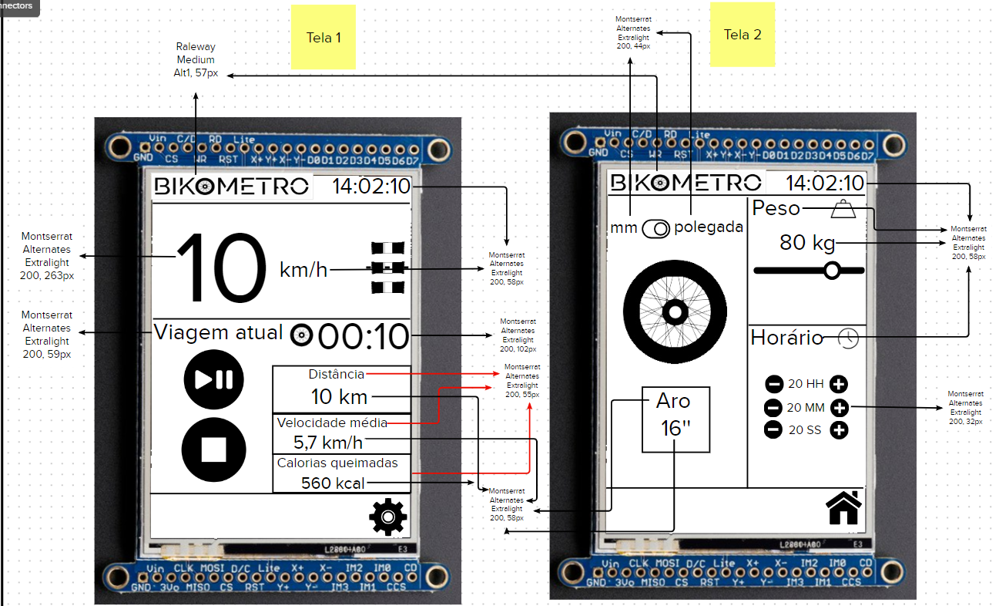
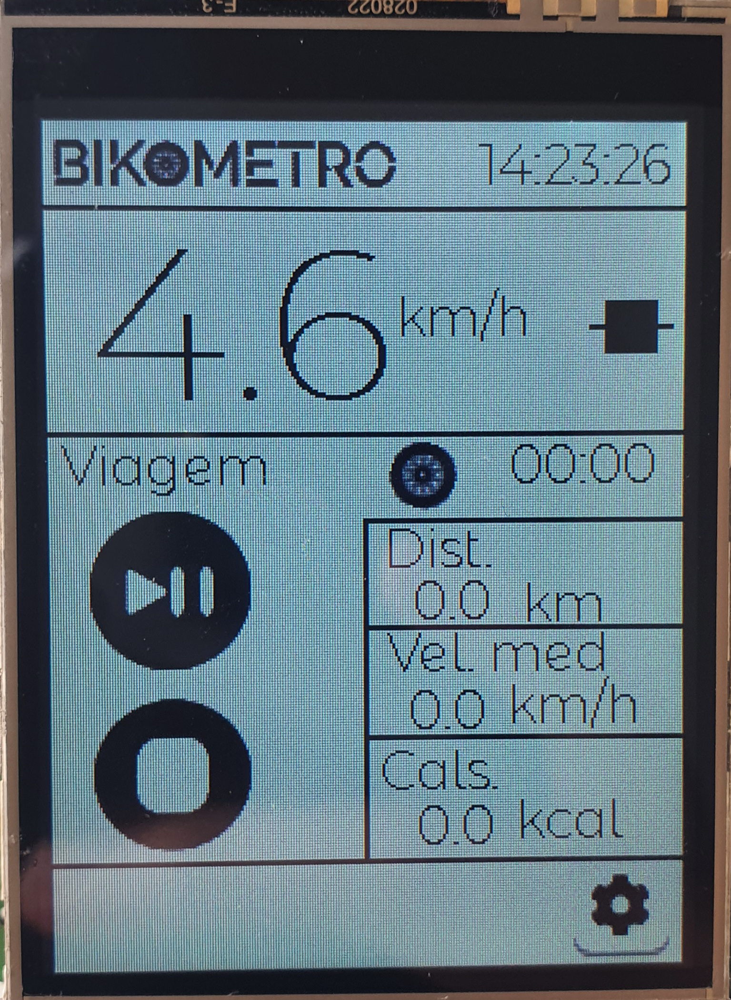

# Cycling Computer using SAME-70

The marketing team of a sports equipment company wants to create a new cycling computer, and you have been chosen as an independent developer due to your technical and UX background to create a prototype and validate the idea.

More details on the course website:

- [https://insper.github.io/ComputacaoEmbarcada/navigation/APS/APS-2-Bike/Descricao/](https://insper.github.io/ComputacaoEmbarcada/navigation/APS/APS-2-Bike/Descricao/)

## Details

Members:

- Ricardo Ribeiro Rodrigues
- Guilherme Fontana Louro

Brand Name:

- Bikometro

## Interface

### UX Proposal 1

#### **First Interface Proposal**

#### **Widgets to be Used**

- For buttons, we will use **Image button (lv_imgbtn)** to use icons as buttons.
- For choosing the unit in the second screen, we will use **Switch (lv_switch)**.
- We will use **Image (lv_img)** for the logo.
- For text, we will use **Label (lv_label)**.
- For choosing the bike rim size, we will use **Roller (lv_roller)**.
- For inputting weight, we will use **Slider (lv_slider)**.

### Icon Used
- <a href="https://www.flaticon.com/free-icons/pause" title="pause icons">Pause icons created by bqlqn - Flaticon</a>

#### **Interface Executed on the LCD**

 

 

#### **Video Explaining the Interface**

### UX Proposal 2

Details of the second iteration of the interface proposal:

#### **Video of the Interview with Luiz**

Based on Luiz's feedback, some changes were made to the interface, such as:
- Maximizing screen space, giving more space to speed and buttons.
- Adding the ability to switch between units of measurement (cm/inches).
- The bike rim change buttons switch between predefined values.
- The current bike rim value is displayed on the screen.
- Added a button to return to the home screen on the second screen.

**Video Explaining Iteration 1:**

#### **Image of Proposal 2**

#### **Interface of Proposal 2 Executed on the LCD**

 

 

In this iteration, the **fonts and sizes** used in the interface were also decided:
- For the logo, the [**Raleway Medium Alt1 font**](https://fonts.google.com/specimen/Raleway) was used.
- For the rest of the interface, the [**Montserrat Alternates Extralight 200 font**](https://fonts.google.com/specimen/Montserrat+Alternates?category=Sans+Serif&preview.text=Viagem%20atual&preview.text_type=custom) was used.

These fonts are futuristic, conveying a sense of technology, and are combined with the simplicity and clean design of black on white. This maintains a consistent look with two sans-serif fonts in black on white, making it easy for the user to read during a bike ride.

**In the image below, you can see a photo showing the sizes and fonts in the interface**.

### UX Proposal 3

Details of the third iteration of the interface proposal:

#### **Video of the Second Interview**

Based on the interviewee's feedback, some changes were made:
- A section was added to the interface to show the calories burned during the ride.
- To make this calculation, a field was added for the user to enter their weight, providing greater accuracy to the calorie burn calculation.
- A field was also added to record the current time, so the time is displayed correctly on the display.
- Some repositioning and better use of the screen space.

**Video Explaining Iteration 2:**

#### **Colors**

For the cycling computer interface, we chose to use black and white, which is commonly used in modern interfaces and brings a lightness to the interface, making it less cluttered. Considering this and the brand's modern visual identity, this contrast was preferred.

#### **Image of Proposal 3**

#### **Interface of Proposal 3 Executed on the LCD**

 

 

## Final Result

### Video Demonstrating the Interface

[](https://www.youtube.com/watch?v=rPx16
