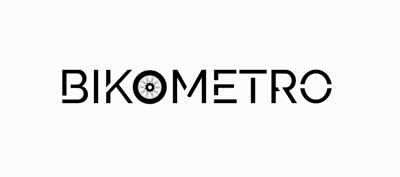
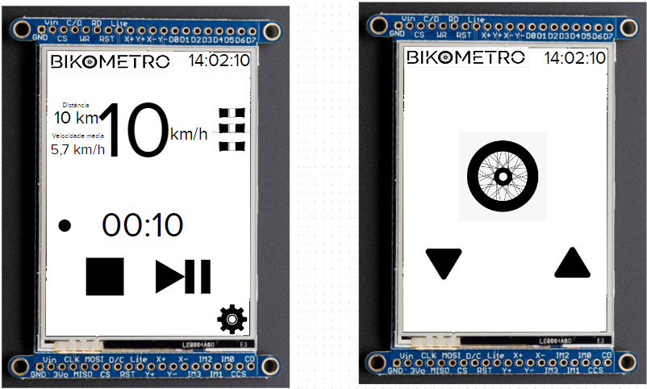
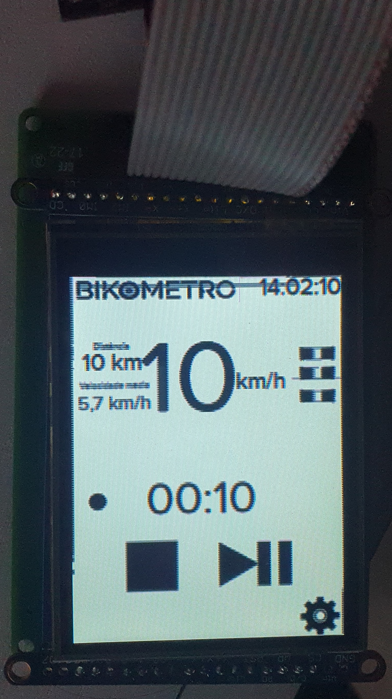
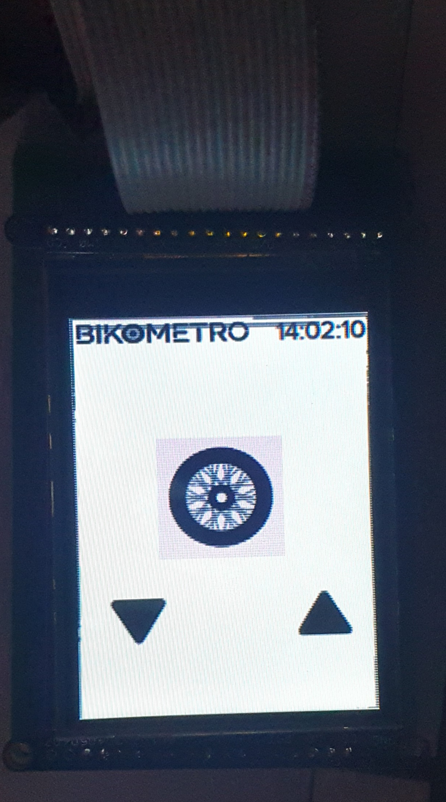
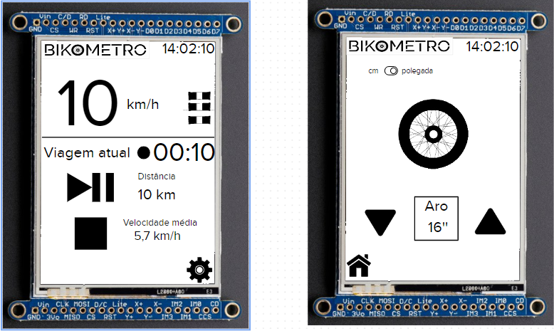
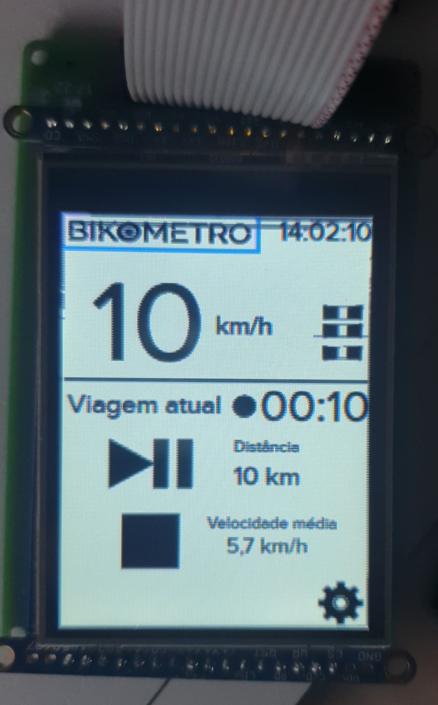
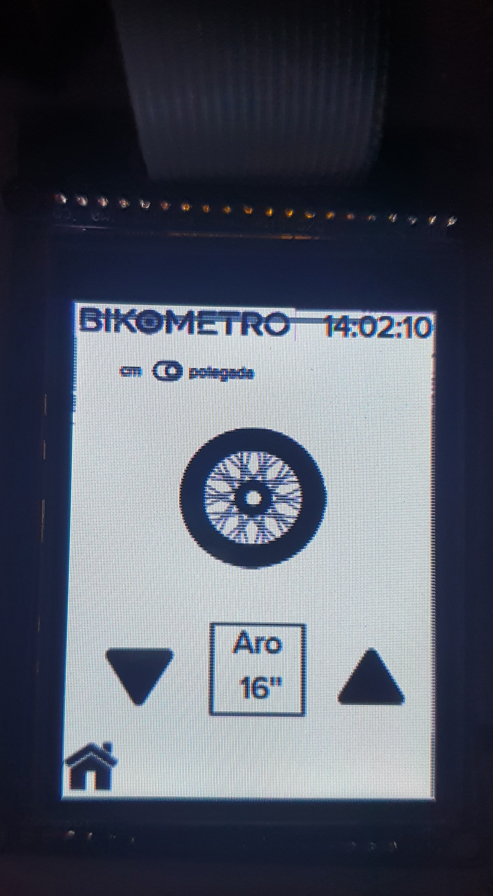

# 21b - APS2 - Embarcados

O marketing de uma empresa de equipamentos esportivos quer criar um novo ciclocomputador e você foi escolhido como desenvolvedor autônomo, dado seu background técnico e de UX, para criar um protótipo e validar a ideia.

Mais detalhes no site da disciplina:

- https://insper.github.io/ComputacaoEmbarcada/navigation/APS/APS-2-Bike/Descricao/

## Detalhes

Integrantes:

- Ricardo Ribeiro Rodrigues
- Guilherme Fontana Louro

Nome da marca:

- Bikometro

## Interface

### Proposta UX 1 - C

#### **Primeira proposta de interface**

#### **Widgets a serem utilizados**

- Para botões, iremos utilizar **Image button (lv_imgbtn)** para utilizar icones como botões.
- Para a unidade escolhida na segunda tela, será utilizado **Switch (lv_switch)**.
- Será utilizado **Image (lv_img)** para o logo.
- Para texto, será utilizado **Label (lv_label)**.

#### **Interface executada no LCD**

 

 

#### **Video explicando a interface**

### Proposta UX 2 - B

> - Especifica e justifica quais vão ser as fontes (e tamanhos) a serem usadas na interface.
> - Pega feedback com o Luiz do Fablab e incorpora na interface
>   - Grava em vídeo a entrevista
> - Grava um vídeo atualizado explicando o que foi sugerido e o que fizeram para melhorar a interface
> - Apresentar uma foto da interface sendo executada no LCD (imagem estática)

Detalhes da segunda interação da proposta de interface:

<!-- 
 Adicionar texto descrevendo a evolução 
 da interface
-->

A partir do feedback do Luiz, foi feito algumas alterações na interface, como:
- Maior aproveitamento do espaço da tela, deixando velocidade e botões com mais espaço.
- Adiciona a possivibilidade de alternar entre as unidades de medida (cm/polegadas).
- Os botões de alterar o aro da bicicleta alternam entre valores predefinidos.
- O valor atual do aro da bicicleta é mostrado na tela.
- Adicionado botão para voltar para tela inicial na segunda tela.

#### **Imagem da proposta 2**

#### **Interface da proposta 2 executada no LCD**

 

 

Nesta iteração, foi decidido também as fontes e tamanhos utilizados na interface:
- Para o logo, foi utilizado a fonte **CONTINUAR DAQUI**

### Proposta UX 3 - A

> - Especifica e justifica as cores a serem usadas na interface
> - Pega feedback com mais uma pessoa externa e incorpora na interface
>     - Grava em vídeo a entrevista
> - Grava um vídeo atualizado explicando o que foi sugerido e o que fizeram para melhorar a interface
> - Apresentar uma foto da interface sendo executada no LCD (imagem estática)

Detalhes da terceira interação da proposta de interface:

<!-- 
 Adicionar texto descrevendo a evolução 
 da interface
-->

- Vídeo 
